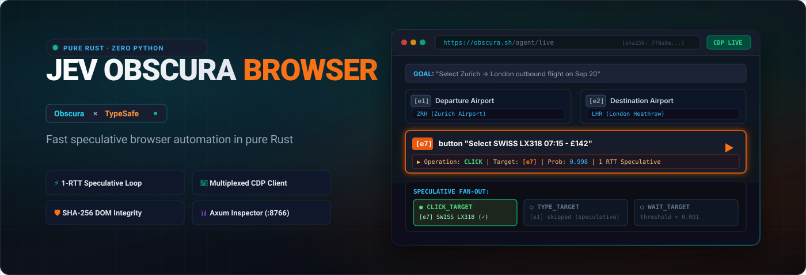
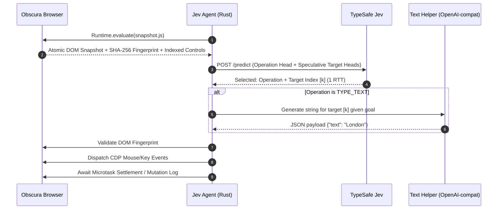

# Jev Obscura Browser ⚡ (Rust)

[](https://www.rust-lang.org)
[](https://obscura.sh/)
[](https://docs.typesafe.ai)
[](http://127.0.0.1:8766)
[](LICENSE)

> A high-performance browser automation agent written in pure Rust pairing [TypeSafe's Jev](https://docs.typesafe.ai) System-One decision engine with [Obscura Browser](https://obscura.sh/) via direct, asynchronous WebSocket Chrome DevTools Protocol (CDP).

---

## Overview

Traditional browser automation agents suffer from severe latency bottlenecks caused by multi-second vision models, iterative round-trips for selector discovery, and brittle CSS/XPath heuristics. **Jev Obscura Browser** eliminates these bottlenecks by replacing heavy multi-modal reasoning loops with:

1. **Dynamic Indexed Perception:** An atomic, client-side DOM snapshot script ([`snapshot.js`](src/snapshot.js)) that identifies interactable controls, extracts accessible labels/geometry, computes a cryptographic SHA-256 state fingerprint, and maps every target candidate to a dense numeric index (`[1]`, `[2]`, ...).
2. **1-Round-Trip Speculative Fan-Out:** [TypeSafe's Jev](https://docs.typesafe.ai) decision engine evaluates the high-level operation (`CLICK`, `TYPE_TEXT`, `SELECT`, `WAIT`, `DONE`, `BLOCKED`) and all speculative target heads (`click_target`, `type_text_target`, `select_target`) simultaneously in a single HTTP request.
3. **Pure Rust Async Execution:** A multiplexed WebSocket CDP engine connects directly to Obscura Browser to dispatch native clicks, keystrokes, and navigation with sub-millisecond protocol overhead and zero Python dependencies.

---

## The Dynamic Indexed Action Space

Every browser observation generates a fresh, structured candidate table representing interactable elements currently visible in the DOM:

```text
[1] button    "Search flights"      · (x: 412, y: 180, w: 120, h: 40)
[2] combobox  "Where from?"         · San Francisco (SFO)
[3] combobox  "Where to?"           · empty
[4] textbox   "Departure date"      · 2026-09-20
[5] select    "Cabin class"         · [options: Economy, Business, First]
[6] button    "Find flights"        · (x: 820, y: 180, w: 140, h: 40)
```

### Speculative Fan-Out Evaluation

Rather than issuing sequential LLM calls to decide *what* to do and then *where* to click, the agent sends one structured decision request to TypeSafe Jev:

```text
                           One TypeSafe Request (1 RTT)
                     ┌───────────────────────────────────────┐
                     │ High-Level Operation Decision         │
                     │  - CLICK, TYPE_TEXT, WAIT, DONE...    │
                     ├───────────────────────────────────────┤
Page Observation ──> │ Speculative Target Heads:             │
 (Indexed Elements)  │  - click_target:       [1, 2, 4, 6]   │
                     │  - type_text_target:   [2, 3, 4]      │
                     │  - select_target:      [5]            │
                     └───────────────────┬───────────────────┘
                                         │
                   Selected Operation Resolves Target
                                         │
        ┌────────────────────────────────┴────────────────────────────────┐
        ▼                                                                 ▼
If CLICK selected:                                              If TYPE_TEXT selected:
Consume `click_target` (e.g. [6])                               Consume `type_text_target` (e.g. [3])
Direct CDP Input Dispatch ──> Obscura                           Invoke Text LLM ──> CDP Input Dispatch
```

### Perception & Execution Loop



---

## Key Features

- **Pure Rust Architecture:** Zero Python runtime, zero virtual environments, instant startup, minimal memory footprint, and compile-time concurrency safety.
- **Multiplexed WebSocket CDP Client:** Asynchronous Tokio-based WebSocket communication with Obscura Browser supporting simultaneous request/response correlation and protocol event streaming.
- **Cryptographic DOM Fingerprinting:** Every atomic DOM snapshot calculates a SHA-256 fingerprint. Stale page updates or background mutations are detected prior to input execution, enforcing strict safety guarantees.
- **Axum Web Inspector Server:** Built-in web inspector server listening on port `8766` providing live interactive inspection, manual step-by-step execution, probability distributions, and state visualization.
- **Headless CLI Execution:** Fast headless batch execution via `cargo run -- run --url <URL> --goal <GOAL>`.
- **Obscura Process Supervisor:** Automatic background process management capable of locating and spawning Obscura Browser binaries if not already running.

---

## Prerequisites & Obscura Setup

Jev Obscura Browser communicates with an active [Obscura Browser](https://obscura.sh/) instance exposing a Chrome DevTools Protocol (CDP) WebSocket endpoint on port `9222`.

### Option A: Local Obscura Binary
If you have installed the native Obscura Browser binary:
```bash
obscura serve --port 9222
```

### Option B: Obscura Docker Container
Run an isolated Obscura instance via Docker:
```bash
docker run -d --name obscura-browser -p 127.0.0.1:9222:9222 h4ckf0r0day/obscura
```

---

## Installation & Build

Build the project with Rust (Cargo):

```bash
# Clone the repository
git clone https://github.com/PauloLuan/jev-obscura-browser.git
cd jev-obscura-browser

# Build optimized release binaries
cargo build --release
```

The compiled binaries will be located at:
- `target/release/jev-obscura` (Primary application binary)
- `target/release/jev` (CLI alias)

---

## Configuration

Copy `.env.example` to `.env` and configure your API keys and endpoints:

```bash
cp .env.example .env
```

| Variable | Description | Default |
|---|---|---|
| `TYPESAFE_API_KEY` | API key for the TypeSafe Jev System-One decision engine | *(Required for live agent runs)* |
| `TEXT_MODEL_API_KEY` | API key for OpenAI-compatible text generation LLM | *(Required for `TYPE_TEXT`)* |
| `OBSCURA_URL` | WebSocket CDP endpoint of the Obscura Browser | `ws://127.0.0.1:9222` |
| `OBSCURA_BIN` | Path to Obscura executable if using auto-supervisor | *(Optional)* |
| `PORT` | Local port for the Axum Web Inspector | `8766` |
| `TEXT_MODEL_NAME` | Model name for OpenAI-compatible text generator | `inception/mercury-2.5` |
| `TEXT_MODEL_BASE_URL` | Base URL for OpenAI-compatible endpoint | `https://openrouter.ai/api/v1` |

---

## Usage

### 1. Web Inspector Mode
Launch the Axum Web Inspector UI and open your browser at `http://127.0.0.1:8766`:

```bash
cargo run -- serve --port 8766
```

Open [http://127.0.0.1:8766](http://127.0.0.1:8766) in your browser:
- Input a starting URL and natural-language goal.
- Click **Start / Reset** to attach to Obscura and capture the initial DOM state.
- Use **Step** for automatic continuous progression or **Choose Next** for interactive step-by-step prediction and action inspection.
- Inspect real-time candidate probability distributions, element bounding boxes, and action history.

### 2. Headless CLI Mode
Run automated browser tasks directly from the command line:

```bash
cargo run -- run \
  --url "https://news.ycombinator.com" \
  --goal "Find the top story and click on its comments link" \
  --max-steps 15
```

### 3. Diagnostics & Environment Check
Verify connectivity to Obscura Browser, API key availability, and local configuration:

```bash
cargo run -- check
```

---

## Architecture & Safety Rules

- **Mutation Safety:** Never retry browser mutations blindly. Every dispatched interaction is recorded and logged before observing state changes.
- **Freshness Checking:** Prior to executing any click or keystroke, the agent compares the target element's node identity and the current DOM SHA-256 fingerprint against the observation state. If the document has mutated or scrolled out of view, the action is rejected and state is re-acquired.
- **Model Safety:** The decision engine and LLM are strictly sandboxed:
  - The model **never** generates executable JavaScript, shell commands, or arbitrary CSS selectors.
  - The model selects solely from the dense candidate indices (`[1]`, `[2]`, ...) observed by `snapshot.js`.
  - Input text payloads for `TYPE_TEXT` are validated against strict JSON schemas before submission.

---

## Development & Testing

All test suites and quality gates run offline without requiring paid API tokens or active browser connections:

```bash
# Verify formatting
cargo fmt --check

# Strict Clippy lint check
cargo clippy --all-targets -- -D warnings

# Run all unit and integration tests
cargo test

# Validate static JavaScript assets
node --check static/app.js
node --check src/snapshot.js

# Build release artifacts
cargo build --release
```

---

## License

This project is licensed under the [MIT License](LICENSE).
